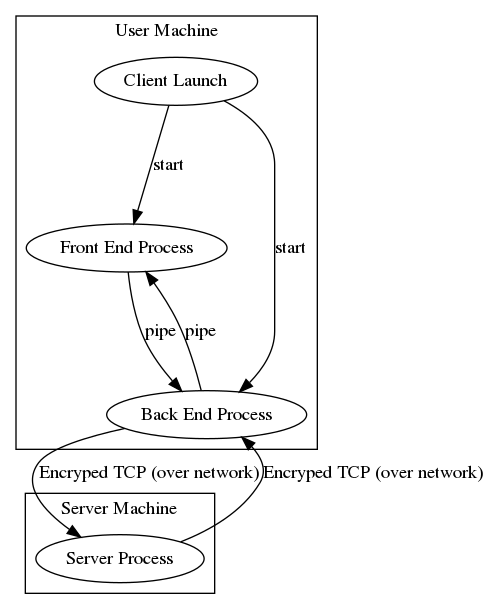

# incognito

An open source, security focused, distributed social media platform.

# Design

## Agile Round 0 Design

### Process / Hardware Architecture Responsibilities

#### The Server Process's Responsibilities
* Hold all of the information regarding the pages.
* Save the Member/Page Graph.
* Maintain all of the TCP sessions with the users.
* Verify the identity of every user that connects via token, and send saved updates.
* Allow a connected user to publish changes to pages they are permitted to.
* Send connected users' updates about pages they are subscribed to.
* Save disconnected users' updates about pages they are subscribed to.
* Impliments RSA public key encryption using openssl over TCP.

#### The Backend Process's Responsibilities
* Establish connection to the Server Proccess, using token to verify identity.
* Launch the Front End Process.
* Handle all data about a user that is not stored by the Server Process.
* Accept requests from the Front End Process and pass them along to the Server Process.
* Send responses to the Front End Process once it has been obtained (either from storage or the Server Process).
* Get data from the Server Process when appropriatem, including an identifying token on first connect.
* Post data to the Server Process when appropriate.
* Impliments RSA public key encryption using openssl over TCP.

#### The Front End Process's Responsibilities
* Provide a GUI interface to the user that is resonsive and transparent.
* Post data to the Back End Process when the user enters data.
* Request data from the Back End Process when the user requests data.

The reason for having a Back End Process at all is that eventually, we will be mograting the responsibilites of the server to the Back End once we implimnet distributed ledgers for pages as opposed to centralized server ledgers.

### Specifications of Communication Between Processes

The communication between all processes will follow the same basic structure:

* A process makes a request of another process
* The other process resonds with a status update of the request

#### The Structure of A Request

`VERB SUBJECT OBJECT(S)`

* Spaces deliminate the "words".
* There may be as few as 0 objects
* A newline character marks the end of message.

#### The Structure of a Response

`hash(REQUEST) STATUS DATA[OPTIONAL]`

* Spaces deliminate the "words".
* There are at least three valid statuses for every verb: in_progress failed success
* There may be as little as 0 DATA entries.
* A newline character marks the end of the message.
* The hash function is MD5

The reasoning for these somewhat limiting structures as opposed to using something more flexible like JSON is that this is easy to interpret in any programming language.

### Verbs

##### user_add

user_add USERNAME

##### page_add

page_add PAGE_NAME SUBSCRIBERS PUBLISHERS

#### page_post

page_post PAGE_NAME "PAGE MESSAGE"

#### page_recv

page_recv PAGE_NAME "PAGE MESSAGE"

#### page_update

page_update PAGE_NAME SUBSCRIBERS_DELTA PUBLISEHRS_DELTA
